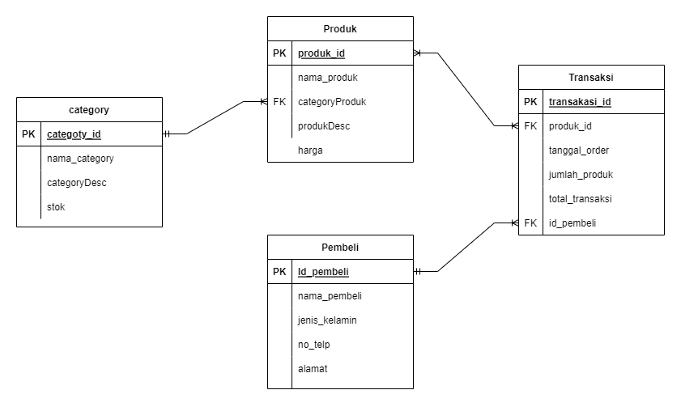
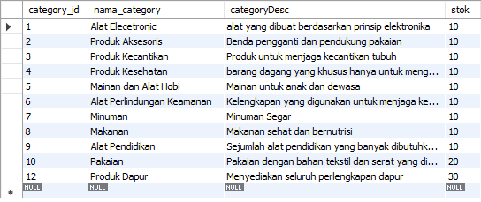
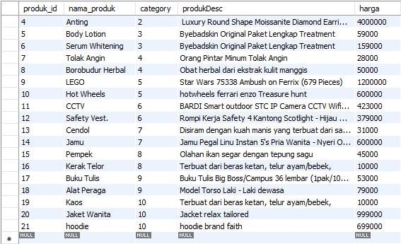
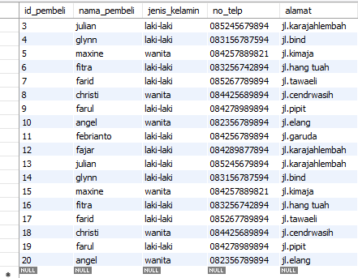
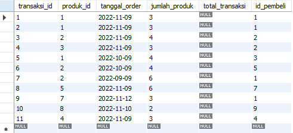
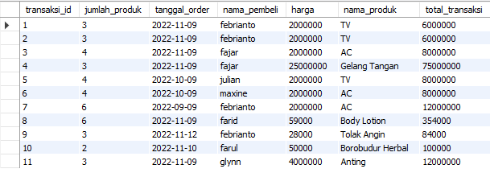
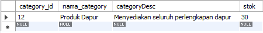
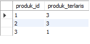

# Online Retail Database Design

##  ERD (Entity Relationship Diagram)

Tampilan relasi antar tabel

 

## Data Pada Tabel

- Tabel Category

    

- Tabel Produk

    

- Tabel Pembeli

    

- Tabel Transaksi 

    

    - detail data pada tabel transaksi dengan menampilkan si nama pembeli, nama produk dan total transaksi

      

## Beberapa Query kasus 

- Melihat Kategori barang yang paling banyak barangnya.

    

- Melihat 3 produk yang paling sering dibeli oleh pelanggan.

    